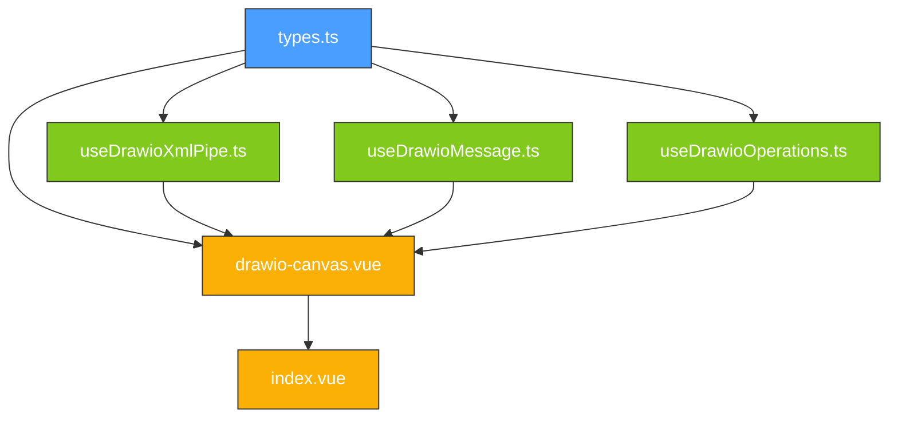

# 20250529-drawio-canvas.implementation.plan

## 任务清单

### T1: 创建 `components/drawio-canvas/types.ts`

**文件**: `apps/web/components/drawio-canvas/types.ts` (新文件)

**产出**:
- `DrawioUrlParams` interface
- `DrawioCanvasEmits` interface (含 `init`, `load`, `save`, `exit`, `autosave`, `export`, `error`, `iframe-ready`, `template`)
- `Bounds` interface
- `EventLoadPayload`, `EventSavePayload`, `EventAutoSavePayload`, `EventExitPayload`, `EventExportPayload`, `EventTemplatePayload`, `DrawioErrorPayload`
- `EventConfigure`, `EventMergePayload`, `EventPromptPayload`, `EventDraftPayload`, `EventOpenLinkPayload`, `EventTextContentPayload`
- `LoadOptions`, `ExportOptions`, `ExportFormat` type
- `DiagramOperation`, `OperationError`, `ApplyOperationsResult`
- `LoadAction`, `ExportAction`, `MergeAction`, `DialogAction`, `PromptAction`, `TemplateAction`, `LayoutAction`, `DraftAction`, `StatusAction`, `SpinnerAction`, `ConfigureAction`, `ViewportAction`, `TextContentAction`

**验证标准**:
1. 所有 interface 使用 `export` 关键字导出
2. 所有可选字段使用 `?:` 标记
3. `DrawioCanvasEmits` 使用 Vue 3 的 `(e: 'eventName', payload: T): void` 函数重载签名格式
4. 无 `any` 类型出现
5. TypeScript 严格模式下无编译错误

### T2: 创建 `composables/useDrawioXmlPipe.ts`

**文件**: `apps/web/composables/useDrawioXmlPipe.ts` (新文件)

**产出**:
- 函数 `normalizeXml(xml: string, maxSize: number): { result: string; error: string | null }` (exported)
- 内部函数 `stripAiWrapperTags(xml: string): string`
- 内部函数 `isMxCellXmlComplete(xml: string): boolean`
- 内部函数 `cleanOrphanedMxPoints(xml: string): string`
- 内部函数 `escapeIllegalAmpersands(xml: string): string`
- 内部函数 `wrapWithMxFile(xml: string): string`
- 内部函数 `validateMxCellStructure(xml: string): string | null`

**`normalizeXml` 管线执行顺序**:

| 步骤 | 函数 | 失败行为 |
|---|---|---|
| 0 | 检查 `xml.length > maxSize` | 返回 `{ error: 'XML_SIZE_EXCEEDED' }` |
| 1 | `stripAiWrapperTags` | 继续执行 |
| 2 | `isMxCellXmlComplete` | 返回 `{ error: 'TRUNCATED_XML' }` |
| 3 | `cleanOrphanedMxPoints` | 继续执行 |
| 4 | `escapeIllegalAmpersands` | 继续执行 |
| 5 | `wrapWithMxFile` | 继续执行 |
| 6 | `validateMxCellStructure` | 返回 `{ error: 'XML_VALIDATION_FAILED' }` |

**`wrapWithMxFile` 分支逻辑**:
- 输入 `''` → `<mxfile><diagram name="Page-1" id="page-1"><mxGraphModel><root><mxCell id="0"/><mxCell id="1" parent="0"/></root></mxGraphModel></diagram></mxfile>`
- 输入包含 `<mxfile` → 原样返回
- 输入包含 `<mxGraphModel` → 外层包裹 `<mxfile><diagram name="Page-1" id="page-1"> ... </diagram></mxfile>`
- 输入包含 `<root>` → 提取内部内容，移除以 `id="0"` 或 `id="1"` 为属性的 mxCell，拼接 `ROOT_CELLS` 后重新包装
- 其他（裸 mxCell）→ 注入 `<root>` 内自动添加根细胞

**`validateMxCellStructure` 校验项**:
1. DOMParser 解析检查语法错误
2. `checkDuplicateIds`: 正则 `\bid\s*=\s*["']([^"']+)["']` 扫描重复
3. `checkNestedMxCells`: 手动栈扫描，排除 `as="valueLabel"` 和 `as="geometry"`
4. `checkDuplicateAttributes`: 统计 `edge`, `parent`, `source`, `target`, `vertex`, `connectable` 出现次数
5. `checkEntityReferences`: 匹配 `&entity;` 模式，验证是否在合法集合 `{lt, gt, amp, quot, apos}` 中

**验证标准**:
1. `normalizeXml` 对 `''` 输入返回完整空结构 mxfile XML
2. `normalizeXml` 对包含 `</mxParameter>foo</invoke>` 的输入正确剥离包装标签
3. `wrapWithMxFile` 对裸 `<mxCell id="2"/>` 输出包含 `id="0"` 和 `id="1"` 的完整层级
4. `cleanOrphanedMxPoints` 删除无 `as` 属性且不在 `<Array as="points">` 内的 `<mxPoint/>`
5. `escapeIllegalAmpersands` 将 `A & B` 转换为 `A &amp; B`，但保留 `&lt;`
6. `validateMxCellStructure` 对重复 ID 返回非 null error
7. 无 `any` 类型

### T3: 创建 `composables/useDrawioMessage.ts`

**文件**: `apps/web/composables/useDrawioMessage.ts` (新文件)

**产出**:
- 函数 `useDrawioMessage(iframeRef, handlers, xmlPipe)` (exported)
- 内部函数 `handleMessage(event: MessageEvent): void`

**`useDrawioMessage` 签名**:
```typescript
interface DrawioMessageHandlers {
  onInit: () => void
  onLoad: (payload: EventLoadPayload) => void
  onSave: (payload: EventSavePayload) => void
  onExit: (payload: EventExitPayload) => void
  onAutosave?: (payload: EventAutoSavePayload) => void
  onExport: (payload: EventExportPayload) => void
  onError: (payload: DrawioErrorPayload) => void
  onTemplate?: (payload: EventTemplatePayload) => void
}

function useDrawioMessage(
  iframeRef: Ref<HTMLIFrameElement | null>,
  handlers: DrawioMessageHandlers
): {
  sendAction: (action: Record<string, unknown>) => void
  requestExport: (format: ExportFormat, options?: ExportOptions) => Promise<EventExportPayload>
  cleanup: () => void
}
```

**`handleMessage` 路由逻辑**:
1. `event.origin !== 'https://embed.diagrams.net'` → `return`
2. `event.source !== iframeRef.value?.contentWindow` → `return`
3. 按 `event.data.event` 值分发:
   - `'init'` → `handlers.onInit()`
   - `'load'` → `handlers.onLoad(event.data)`
   - `'save'` → `handlers.onSave(event.data)`
   - `'exit'` → `handlers.onExit(event.data)`
   - `'autosave'` → `handlers.onAutosave?.(event.data)`
   - `'export'` → `handlers.onExport(event.data)`
   - `'template'` → `handlers.onTemplate?.(event.data)`
4. `event.data` 包含 `error` 字段 → `handlers.onError(event.data)`

**`sendAction` 逻辑**:
- `iframeRef.value?.contentWindow?.postMessage(JSON.stringify(action), 'https://embed.diagrams.net')`

**`requestExport` 逻辑**:
1. 检查 `pendingExportResolve` 是否存在 → 存在则 reject('EXPORT_CANCELLED')
2. `sendAction({ action: 'export', format, ...options })`
3. 返回 `new Promise<EventExportPayload>`，resolve 挂载到 `pendingExportResolve`
4. 启动 30s `setTimeout` → 超时 reject('MESSAGE_TIMEOUT')
5. `handlers.onExport` 内部调用 `pendingExportResolve(payload)`

**`cleanup` 逻辑**:
- `window.removeEventListener('message', handleMessage)`
- 清除 `setTimeout`
- `pendingExportResolve` 存在 → reject('COMPONENT_UNMOUNTED')

**生命周期绑定**:
- `onMounted` → `window.addEventListener('message', handleMessage)`
- `onUnmounted` → `cleanup()`

**验证标准**:
1. `handleMessage` 对 `event.origin !== 'https://embed.diagrams.net'` 的消息静默忽略
2. `handleMessage` 对 `event.source !== iframeRef.value?.contentWindow` 的消息静默忽略
3. `sendAction` 的 `postMessage` 第二个参数为 `'https://embed.diagrams.net'` 而非 `'*'`
4. `requestExport` 返回 Promise，在收到 export 事件后 resolve
5. `requestExport` 在 30s 内未收到响应时 reject
6. `cleanup` 调用后 message 事件不再触发
7. 无 `any` 类型

### T4: 创建 `composables/useDrawioOperations.ts`

**文件**: `apps/web/composables/useDrawioOperations.ts` (新文件)

**产出**:
- 函数 `useDrawioOperations(): { applyOperations }` (exported)

**`applyOperations(xmlContent, operations)` 内部逻辑**:

1. `DOMParser` 解析 `xmlContent`
2. 检查 `doc.querySelector('parsererror')` → 存在则返回 error
3. 查找 `doc.querySelector('root')` → 不存在则返回 error
4. 构建 `cellMap = new Map<string, Element>()` 通过 `root.querySelectorAll('mxCell')`
5. 遍历 `operations` 数组:

| type | 前置校验 | 操作 | 错误处理 |
|---|---|---|---|
| `update` | `cellMap.get(cell_id)` 不存在 → error; `new_xml` 不含 mxCell → error; 新 xml id 与 cell_id 不匹配 → error | `replaceChild(doc.importNode(newCell, true), existingCell)` | 记录 error，跳过，继续 |
| `add` | `cellMap.has(cell_id)` → error; `new_xml` 不含 mxCell → error; 新 xml id 与 cell_id 不匹配 → error | `root.appendChild(doc.importNode(newCell, true))` | 记录 error，跳过，继续 |
| `delete` | `cellMap.get(cell_id)` 不存在 → error; 存在则 `querySelectorAll('mxCell[source="id"], mxCell[target="id"]')` 收集引用 edge, `console.warn` | `removeChild`, `cellMap.delete` | 记录 error，跳过，继续 |

6. `XMLSerializer().serializeToString(doc)` → 返回 `{ result, errors }`

**验证标准**:
1. `applyOperations` 对不存在的 cell_id 的 update 操作返回 error，不修改 XML
2. `applyOperations` 对已存在 cell_id 的 add 操作返回 error，不修改 XML
3. `applyOperations` 对合法的 add 操作正确追加 mxCell
4. `applyOperations` 对合法的 delete 操作正确移除 mxCell
5. `applyOperations` 对引用被删细胞的 edge 输出 `console.warn`（不影响删除）
6. `applyOperations` 对非法 XML 输入返回 error 而非抛异常
7. 无 `any` 类型

### T5: 实现 `components/drawio-canvas/drawio-canvas.vue`

**文件**: `apps/web/components/drawio-canvas/drawio-canvas.vue` (新文件)

**模板结构**:
```
<template>
  <div class="drawio-canvas-container" :style="{ height, width }">
    <div v-if="isLoading">
      <n-card><n-spin /></n-card>
    </div>
    <div v-else-if="errorMessage">
      <n-alert type="error">{{ errorMessage }}</n-alert>
      <n-button @click="handleRetry">重试</n-button>
    </div>
    <iframe
      v-show="!isLoading && !errorMessage"
      ref="iframeRef"
      :src="embedUrl"
      sandbox="allow-scripts allow-same-origin allow-forms allow-popups"
      title="draw.io Diagram Editor"
      class="w-full h-full border-0"
    />
  </div>
</template>
```

**Script 逻辑**:
```
defineProps: initialXml, embedUrlParams, height, width, autosave, configure, maxXmlSize
defineEmits<DrawioCanvasEmits>()

计算属性 embedUrl:
  new URL('https://embed.diagrams.net/')
  + '?embed=1&proto=json'
  + 展开 embedUrlParams 为搜索参数

状态: iframeRef, isLoading(true), isReady(false), errorMessage(null)
状态: pendingExportResolve(null) // 由 useDrawioMessage 管理

onMounted:
  useDrawioMessage(iframeRef, { onInit, onSave, onExit, onLoad, onAutosave, onExport, onError, onTemplate })
  onInit 回调:
    xmlPipe.normalizeXml(initialXml.value, maxXmlSize)
      → error 存在 → emit('error', ...)
      → 成功 → sendAction({ action: 'load', xml: result, autosave: props.autosave || undefined })

defineExpose:
  loadXml(xml) → xmlPipe.normalizeXml(xml, maxXmlSize) → sendAction({ action: 'load', xml: result })
  exportXml(format, options) → requestExport(format, options)
  getCurrentXml() → requestExport('xml')
  mergeXml(xml) → sendAction({ action: 'merge', xml })
  triggerSave() → sendAction({ action: 'export', format: 'xml' })  // 触发 draw.io 返回 xml
  setEditorConfig(config) → sendAction({ action: 'configure', config })
  applyOperations(ops) → useDrawioOperations().applyOperations(getCurrentXmlPromise 解析后的 xml, ops)

onUnmounted:
  // useDrawioMessage 内部绑定 cleanup
```

**验证标准**:
1. `<script setup lang="ts">` 语法
2. `defineProps<T>()` 带类型参数
3. `defineEmits<DrawioCanvasEmits>()`
4. iframe 包含 `sandbox` 属性且包含 `allow-scripts allow-same-origin allow-forms allow-popups`
5. iframe 包含 `title` 属性
6. 加载态显示 Naive UI 组件（`n-card` + `n-spin`）
7. 错误态显示 Naive UI 组件（`n-alert` + 重试按钮）
8. `loadXml`, `exportXml`, `getCurrentXml`, `mergeXml`, `triggerSave`, `setEditorConfig`, `applyOperations` 通过 `defineExpose` 暴露
9. `onUnmounted` 中清理 message 监听器（依赖 useDrawioMessage 的 cleanup）
10. `sendAction` 使用 `targetOrigin: 'https://embed.diagrams.net'`（依赖 useDrawioMessage）
11. 无 `any` 类型
12. 无 JSX/TSX

### T6: 修改 `pages/index.vue` 集成 DrawioCanvas

**文件**: `apps/web/pages/index.vue` (修改文件)

**改动**:
- 替换占位内容为 DrawioCanvas 完整集成
- 按 Spec §7 Examples 编写调用代码
- 使用 `@init`, `@save`, `@exit`, `@autosave`, `@error` 事件绑定
- 暴露 `canvasRef` 以便编程式调用

**验证标准**:
1. 页面渲染 DrawioCanvas 组件而非占位卡片
2. 传入 `ref="canvasRef"` 可访问组件实例
3. `@init`, `@save`, `@exit`, `@error` 事件处理器存在
4. 无 JSX/TSX
5. `<script setup lang="ts">` 语法

## 依赖关系图



## 验收检查表

| ID | 检查项 | 验证方式 | 通过条件 |
|---|---|---|---|
| AC1 | `types.ts` 所有类型导出 | `tsc --noEmit` | 无类型错误 |
| AC2 | `useDrawioXmlPipe.normalizeXml('')` 返回空结构 | 单元测试 | `result` 包含 `mxCell id="0"` 和 `id="1"` |
| AC3 | `useDrawioXmlPipe.normalizeXml(AI_RAW_XML)` 剥离包装标签 | 单元测试 | `result` 不含 `</mxParameter>` |
| AC4 | `useDrawioXmlPipe.normalizeXml(ORPHANED_MXPOINT_XML)` 清理 mxPoint | 单元测试 | `result` 不含无属性 `<mxPoint/>` |
| AC5 | `useDrawioXmlPipe.normalizeXml(UNESCAPED_AMP_XML)` 转义 & | 单元测试 | `result` 中 `A & B` 变为 `A &amp; B` |
| AC6 | `useDrawioXmlPipe.normalizeXml(DUPLICATE_ID_XML)` 校验失败 | 单元测试 | `error` 为 `XML_VALIDATION_FAILED` |
| AC7 | `useDrawioMessage.handleMessage` 校验 origin | 单元测试 | 非白名单 origin 的消息被忽略 |
| AC8 | `useDrawioMessage.handleMessage` 校验 source | 单元测试 | 不匹配 iframe source 的消息被忽略 |
| AC9 | `useDrawioMessage.sendAction` 使用正确 targetOrigin | 代码审查 + 单元测试 | `postMessage` 第二个参数为 `'https://embed.diagrams.net'` |
| AC10 | `useDrawioMessage.requestExport` 超时机制 | 单元测试 | 30s 未响应时 reject |
| AC11 | `useDrawioMessage.cleanup` 移除监听器 | 单元测试 | cleanup 后 message 事件 handler 不触发 |
| AC12 | `useDrawioOperations.applyOperations` update 合法 | 单元测试 | mxCell 被正确替换 |
| AC13 | `useDrawioOperations.applyOperations` add 冲突 | 单元测试 | error 数组包含 ID 冲突信息，XML 不变 |
| AC14 | `useDrawioOperations.applyOperations` delete 被引用 | 单元测试 | 细胞删除成功，console.warn 被调用 |
| AC15 | `useDrawioOperations.applyOperations` 非法 XML | 单元测试 | 返回 error，不抛异常 |
| AC16 | `drawio-canvas.vue` 使用 `<script setup lang="ts">` | 代码审查 | 是 |
| AC17 | `drawio-canvas.vue` 使用 `defineProps<T>()` | 代码审查 | 是 |
| AC18 | `drawio-canvas.vue` 使用 `defineEmits<DrawioCanvasEmits>()` | 代码审查 | 是 |
| AC19 | `drawio-canvas.vue` iframe 包含 `sandbox` 属性 | 代码审查 | 包含 `allow-scripts allow-same-origin allow-forms allow-popups` |
| AC20 | `drawio-canvas.vue` iframe 包含 `title` 属性 | 代码审查 | 值为 `"draw.io Diagram Editor"` |
| AC21 | `drawio-canvas.vue` 加载态使用 Naive UI 组件 | 代码审查 | 模板包含 `<n-spin>` 或 `<n-card>` |
| AC22 | `drawio-canvas.vue` 错误态使用 Naive UI 组件 | 代码审查 | 模板包含 `<n-alert>` |
| AC23 | `drawio-canvas.vue` 暴露 7 个方法 | 代码审查 | `defineExpose` 包含全部方法 |
| AC24 | `drawio-canvas.vue` 卸载时清理 | 代码审查 | `onUnmounted` 触发 `cleanup` |
| AC25 | `drawio-canvas.vue` 无 `any` 类型 | `tsc --noEmit` | 无相关 lint 错误 |
| AC26 | `index.vue` 渲染 DrawioCanvas | 代码审查 | 模板包含 `<DrawioCanvas>` |
| AC27 | 全部文件无 JSX/TSX | `tsc --noEmit` | 无 JSX 相关编译错误 |
| AC28 | 全部文件使用 `<script setup lang="ts">` | 代码审查 | 每个 `.vue` 文件均使用 |