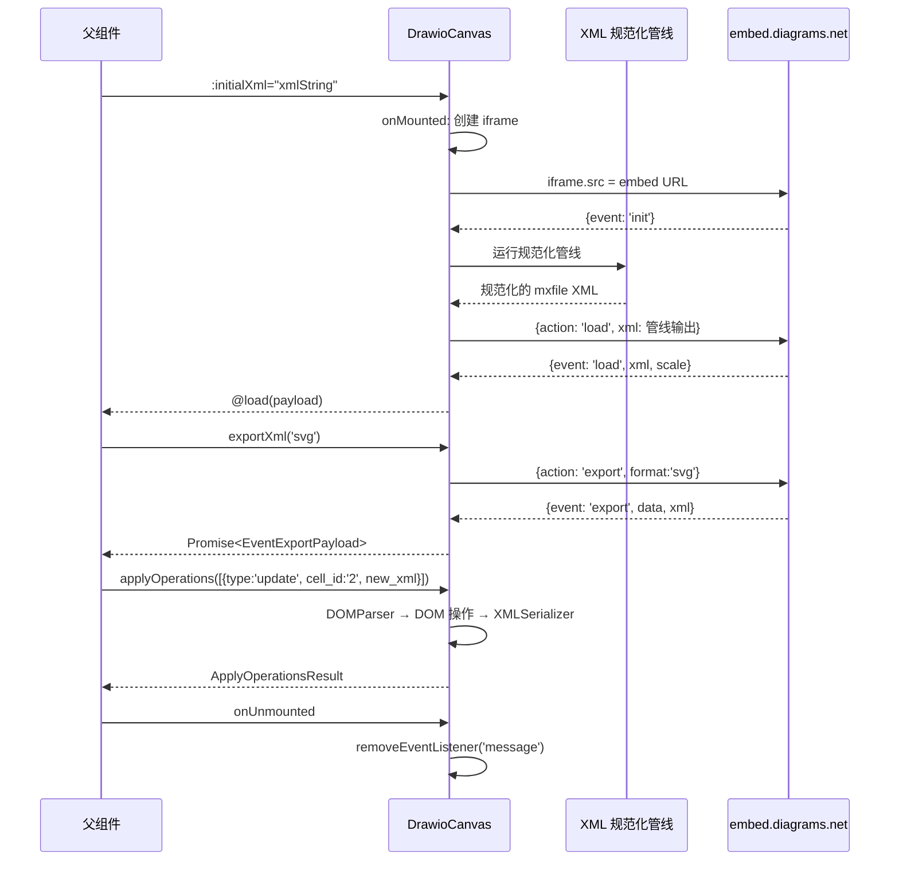

# DrawioCanvas Spec

## 1. Context (上下文)

- **目标**: 提供一个核心画布组件，通过 `<iframe>` 嵌入 draw.io 编辑器（`https://embed.diagrams.net/?embed=1&proto=json`），封装完整的 `postMessage` 双向通信逻辑。父组件可通过该组件加载/导出 XML 图谱数据。
- **所属层级**: UI 组件（Vue 3 Single File Component）
- **关联依赖**:
  - draw.io embed 官方端点: `https://embed.diagrams.net`
  - 仅使用原生 `window.postMessage` / `window.addEventListener('message')`
  - **禁止**引入任何 React 生态的 draw.io 包装库
  - 共享类型包 `@ai-drawio/shared`（`DrawioShape`, `DrawioDocument` 等）
- **XML 数据架构**: draw.io 的 XML 文档遵循严格的四级层级结构：
  ```
  <mxfile>
    <diagram name="Page-1" id="page-1">
      <mxGraphModel>
        <root>
          <mxCell id="0" />              <!-- 根细胞（Root），始终存在 -->
          <mxCell id="1" parent="0" />    <!-- 默认父层（Default parent），始终存在 -->
          <mxCell id="2" ... />           <!-- 用户自定义细胞，id 从 2 开始 -->
          <mxCell id="3" ... />
        </root>
      </mxGraphModel>
    </diagram>
  </mxfile>
  ```
  - `id="0"` 和 `id="1"` 是**根细胞（Root Cells）**，必须始终存在且不可重复
  - 用户/AI 生成的内容只能产生 `id >= "2"` 的 mxCell 元素
- **ID 驱动操作模式**: 所有画布编辑操作（更新、添加、删除）均以 `cell_id` 为唯一标识符进行 DOM 级操作，而非文本匹配。此模式直接映射自旧项目中的 `applyDiagramOperations` 函数设计。

## 2. Interface & Props (接口与契约)

### 输入 (Props)

| Prop 名 | 类型 | 必填 | 默认值 | 描述 |
|---|---|---|---|---|
| `initialXml` | `string` | 否 | `''` | 初始加载的 draw.io XML 图谱数据。接受多种格式（裸 mxCell、`<root>`、`<mxGraphModel>`、`<mxfile>`），组件内部自动规范化。VNode 挂载后自动发送 `load` action。 |
| `embedUrlParams` | `DrawioUrlParams` | 否 | `{ spin: true, libraries: false }` | 自定义 iframe `src` URL 的查询参数。控制 UI 元素显隐与编辑器行为。 |
| `height` | `string` | 否 | `'100%'` | 画布容器高度。 |
| `width` | `string` | 否 | `'100%'` | 画布容器宽度。 |
| `autosave` | `boolean` | 否 | `false` | 是否启用 draw.io 自动保存模式。启用后，每次变更自动触发 `autosave` 事件。 |
| `configure` | `Record<string, unknown>` | 否 | `undefined` | 提供给 draw.io 编辑器的配置对象。传入时自动使用 `configure=1` URL 参数并发送 `configure` action。 |
| `maxXmlSize` | `number` | 否 | `1_000_000` | 最大可处理的 XML 字节数。超过此阈值的 XML 将被拒绝并 emit `error`。 |

```typescript
// 关联类型定义（存放位置：components/drawio-canvas/types.ts 或 packages/shared）
interface DrawioUrlParams {
  /** 是否显示加载动画 */
  spin?: boolean | string
  /** 手动控制"已修改"状态 */
  modified?: boolean | number | string
  /** 是否保持修改状态标记 */
  keepmodified?: boolean
  /** 是否启用左侧形状库面板 */
  libraries?: boolean
  /** 隐藏"保存"按钮，改为"保存并退出" */
  noSaveBtn?: boolean
  /** 显示额外的"保存并退出"按钮 */
  saveAndExit?: boolean
  /** 隐藏"退出"按钮 */
  noExitBtn?: boolean
  /** 加载完成后返回边界信息 */
  returnbounds?: boolean
  /** 自定义 ready 消息值（非 JSON 协议时使用） */
  ready?: string
}
```

### 输出 (Events / Emits)

```typescript
interface DrawioCanvasEmits {
  /** draw.io 编辑器初始化完成 */
  (e: 'init'): void

  /** 图谱数据加载完成，返回加载后的 xml 与缩放比例 */
  (e: 'load', payload: EventLoadPayload): void

  /** 用户点击"保存"或"保存并退出" */
  (e: 'save', payload: EventSavePayload): void

  /** 自动保存触发（仅在 autosave=true 时） */
  (e: 'autosave', payload: EventAutoSavePayload): void

  /** 用户点击"退出" */
  (e: 'exit', payload: EventExitPayload): void

  /** 导出操作完成 */
  (e: 'export', payload: EventExportPayload): void

  /** 发生错误（通信异常、XML 校验失败或 draw.io 返回的 error 消息） */
  (e: 'error', payload: DrawioErrorPayload): void

  /** iframe 加载完成（DOM 事件代理） */
  (e: 'iframe-ready'): void

  /** 模板选择结果 */
  (e: 'template', payload: EventTemplatePayload): void
}
```

### 暴露的方法 (defineExpose)

| 方法签名 | 描述 |
|---|---|
| `loadXml(xml: string, params?: LoadOptions): void` | 向 draw.io iframe 发送 `load` action，加载新的图谱 XML。输入支持多种格式，组件内部自动经过规范化管线处理后发送。 |
| `exportXml(format?: ExportFormat, options?: ExportOptions): Promise<EventExportPayload>` | 请求 draw.io 导出指定格式的数据，返回 Promise（内部监听一次性的 `export` 事件）。 |
| `getCurrentXml(): Promise<string>` | 请求 draw.io 返回当前 XML 数据的快捷方法，等价于调用 `exportXml('xml')`。 |
| `mergeXml(xml: string): void` | 将指定 XML 合并到当前图谱中。 |
| `triggerSave(): void` | 触发编辑器保存（模拟用户点击保存），结果通过 `@save` emit 获取。 |
| `setEditorConfig(config: Record<string, unknown>): void` | 动态更新编辑器配置。 |
| `applyOperations(operations: DiagramOperation[]): ApplyOperationsResult` | 批量执行 ID 驱动的图解操作（更新/添加/删除细胞）。这是旧项目 `applyDiagramOperations` 的逻辑映射——通过 DOM 级操作而非文本替换，保证操作精确性。 |

```typescript
interface LoadOptions {
  autosave?: boolean
  modified?: boolean | number | string
  saveAndExit?: boolean
  noSaveBtn?: boolean
  noExitBtn?: boolean
  title?: string
  libs?: string[]
  dark?: boolean
  theme?: string
}

type ExportFormat = 'svg' | 'xmlsvg' | 'png' | 'xmlpng' | 'html' | 'html2' | 'xml'

interface ExportOptions {
  scale?: number
  border?: number
  background?: string
  transparent?: boolean
  /** 仅 PNG/XMLPNG 有效 */
  width?: number
  /** 仅 SVG/XMLSVG 有效 */
  embedImages?: boolean
}

// ============ ID 驱动图解操作类型（映射自旧项目 applyDiagramOperations） ============

interface DiagramOperation {
  type: 'update' | 'add' | 'delete'
  cell_id: string
  /** update 和 add 操作必填，delete 忽略 */
  new_xml?: string
}

interface OperationError {
  type: 'update' | 'add' | 'delete'
  cellId: string
  message: string
}

interface ApplyOperationsResult {
  result: string   // 操作后的完整 mxfile XML
  errors: OperationError[]
}
```

## 3. Constraints (约束条件 - 极其重要)

- [x] **必须**使用 `<script setup lang="ts">`
- [x] **禁止**使用 `any` 类型（所有 postMessage 数据结构必须使用精确的 TypeScript 类型/interface）
- [x] **必须**在 `onUnmounted` 中调用 `window.removeEventListener('message', handler)` 移除监听器，防止内存泄漏
- [x] **禁止**在 `postMessage` 中使用 `targetOrigin: '*'`。向外发送消息时必须硬编码 `targetOrigin: 'https://embed.diagrams.net'`
- [x] **必须**在 `message` 事件处理器内校验 `event.origin === 'https://embed.diagrams.net'`，忽略所有来自非白名单来源的消息
- [x] **禁止**将 `event.data` 直接作为 HTML 或脚本执行；XML 字符串仅作为数据处理，不得通过 `innerHTML` 等方式渲染
- [x] **必须**在 `<iframe>` 上设置 `sandbox="allow-scripts allow-same-origin allow-forms allow-popups"` 以限制 iframe 能力
- [x] **必须**为 `<iframe>` 设置 `title` 属性以符合无障碍访问（a11y）标准
- [x] **必须**使用 `Naive UI` 的 `NCard` 或 `NSpin` 组件作为画布加载状态的 UI 展示
- [x] 组件命名必须遵循 Vue 3 PascalCase 惯例: `DrawioCanvas.vue`
- [x] 文件名必须小写+中划线: `drawio-canvas.vue`
- [x] 所有 `postMessage` 通信必须在组件挂载后（`onMounted`）初始化，不可在服务端渲染期间调用
- [x] **XML 层级完整性**: 发送给 draw.io 的任何 XML 必须确保完整的四级层级：`<mxfile>` → `<diagram>` → `<mxGraphModel>` → `<root>`。若输入为裸 mxCell 或部分包装，组件必须在内部通过规范化管线自动补全（映射旧项目 `wrapWithMxFile` 逻辑）。
- [x] **根细胞不可重复**: `id="0"` 和 `id="1"`（parent="0"）是结构性根细胞，必须始终存在且全局唯一。任何来自外部输入的 XML 若包含重复的根细胞，组件必须自动去重。
- [x] **ID 全局唯一性**: 同一 `<root>` 下的所有 mxCell 元素的 `id` 属性必须唯一。组件对外部 XML 进行合并/加载时，必须检测并报告 ID 冲突（映射旧项目 `checkDuplicateIds` 逻辑）。
- [x] **禁止嵌套 mxCell**: mxCell 元素必须是 `<root>` 的直接子级（兄弟关系），不得嵌套在其他 mxCell 内部。（映射旧项目 `checkNestedMxCells` 逻辑。注意：`as="valueLabel"` 或 `as="geometry"` 的子标签不受此约束，因为它们不是独立的图谱细胞。）
- [x] **结构属性唯一性**: 每个 mxCell 标签内的结构属性（`edge`, `parent`, `source`, `target`, `vertex`, `connectable`）不得重复出现。
- [x] **& 字符转义**: XML 属性值中的 `&` 字符必须使用 `&amp;` 转义。合法的实体仅限 `lt`, `gt`, `amp`, `quot`, `apos`。组件必须对外部输入中的非法 `&` 进行自动修复。
- [x] **清理 orphaned mxPoint**: 不属于 `<Array as="points">` 且不带 `as` 属性的 `<mxPoint />` 元素必须被剥离，否则 draw.io 会报 "Could not add object mxPoint" 错误。
- [x] **剥离 AI 包装标签**: 来自 AI 的 XML 可能包含函数调用的包装标签（如 `</mxParameter>`、`</invoke>`、`</antml:parameter>`、`</antml:invoke>`），组件在发送给 draw.io 前必须彻底清理这些标签。
- [x] **XML 大小限制**: 处理超过 `maxXmlSize`（默认 1MB）的 XML 时应 emit `error` 并拒绝操作，防止性能退化。

## 4. Data Flow / State (数据流与状态)

### 内部状态管理

```typescript
// 使用 Vue 3 原生 ref/reactive，无需 Pinia
const iframeRef = ref<HTMLIFrameElement | null>(null)
const isLoading = ref(true)          // 是否处于加载态，控制 NSpin 显隐
const isReady = ref(false)           // draw.io 是否已发送 init 事件
const pendingExportResolve = ref<((value: EventExportPayload) => void) | null>(null)  // 用于 exportXml Promise 的 resolve
```

### XML 规范化管线（核心逻辑）

所有外部 XML 在发送给 draw.io iframe 前必须经过以下管线处理。该管线映射了旧项目 `wrapWithMxFile`、`convertToLegalXml`、`isMxCellXmlComplete` 等函数的处理逻辑：

```
输入 XML（支持 5 种格式）
  │
  ├─ 1. 裸 mxCell 片段：<mxCell id="2"><mxGeometry .../></mxCell>
  ├─ 2. <root> 包装：<root><mxCell id="2"/>...</root>
  ├─ 3. <mxGraphModel> 包装：<mxGraphModel><root>...</root></mxGraphModel>
  ├─ 4. 完整 <mxfile>：<mxfile><diagram>...</diagram></mxfile>
  └─ 5. 空字符串：''
      │
      ▼
  Step 1: 剥离 AI 包装标签
      移除 </mxParameter>, </invoke>, </antml:parameter>, </antml:invoke>
      循环执行直到没有更多匹配，因为这些标签可能嵌套出现
      │
      ▼
  Step 2: 片段完整性检查
      如果 XML 不以 /> 或 </mxCell> 结尾 → emit('error', ...)
      （映射 isMxCellXmlComplete 逻辑）
      │
      ▼
  Step 3: 清理 orphaned mxPoint
      移除不在 <Array as="points"> 内部且没有 as 属性的 <mxPoint />
      （映射 convertToLegalXml 中的 mxPoint 清理逻辑）
      │
      ▼
  Step 4: 转义非法 &
      将属性值中非合法实体的 & 替换为 &amp;
      （映射 convertToLegalXml 中的 & 修复逻辑）
      │
      ▼
  Step 5: 构建 mxfile 层级
      根据输入格式选择包装策略（映射 wrapWithMxFile 逻辑）：
        - 空 → 创建完整空结构（含 id="0" 和 id="1"）
        - 已有 <mxfile> → 不动
        - 已有 <mxGraphModel> → 外层包裹 <mxfile><diagram>
        - 有 <root> → 提取内部内容，移除重复的 id="0"/"1" 后重新包装
        - 裸 mxCell → 注入到 <root> 中（自动添加根细胞）
      │
      ▼
  Step 6: 结构校验
      运行 validateMxCellStructure 规则：
        - 重复 ID 检测
        - 嵌套 mxCell 检测
        - 重复结构属性检测
        - 非法实体引用检测
        - 标签闭合匹配检测
      校验失败 → emit('error', { code: 'XML_VALIDATION_FAILED' })
      │
      ▼
  Step 7: 通过 postMessage 发送 {action: 'load', xml: 管线输出}
```

### 数据流时序

```
父组件传入 initialXml (prop)
  ↓
onMounted: 创建 iframe 并挂载到 DOM
  ↓
draw.io 加载完成 → 发送 {event: 'init'}
  ↓
组件收到 init → 触发 XML 规范化管线 → 发送 {action: 'load', xml: 管线输出}
  ↓
draw.io 加载图谱 → 发送 {event: 'load', xml, scale}
  ↓
组件收到 load → emit('load', payload) → isLoading = false
  ↓
用户编辑操作 → (若 autosave) draw.io 发送 {event: 'autosave', xml}
  ↓
用户点击保存 → draw.io 发送 {event: 'save', xml, exit?}
  ↓
用户点击退出 → draw.io 发送 {event: 'exit', modified}
  ↓
父组件调用 exportXml → 发送 {action: 'export', format}
  ↓
draw.io 返回 {event: 'export', format, data, xml}
  ↓
父组件调用 applyOperations(ops) → 组件内部 DOM 解析/操作 → 返回 {result, errors}
  ↓
onUnmounted: 清理所有监听器
```

### ID 驱动操作流程（applyOperations 内部逻辑）

```
applyDiagramOperations(xmlContent, operations)
  │
  ├─ 1. DOMParser 解析 xmlContent
  ├─ 2. 查找 <root> 元素
  ├─ 3. 构建 cellMap: id → Element（遍历所有 mxCell）
  │
  ├─ 对每个 operation:
  │   ├─ type === 'update'
  │   │   ├─ cellMap.get(cell_id) 不存在 → 记录 error
  │   │   ├─ new_xml 不含 mxCell → 记录 error
  │   │   ├─ new_xml 中的 id 与 cell_id 不匹配 → 记录 error
  │   │   └─ 通过后: replaceChild(importedNode, existingCell)
  │   │
  │   ├─ type === 'add'
  │   │   ├─ cellMap 已存在该 cell_id → 记录 error（ID 冲突）
  │   │   ├─ new_xml 不含 mxCell → 记录 error
  │   │   ├─ new_xml 中的 id 与 cell_id 不匹配 → 记录 error
  │   │   └─ 通过后: appendChild(importedNode) 到 <root>
  │   │
  │   └─ type === 'delete'
  │       ├─ cellMap.get(cell_id) 不存在 → 记录 error
  │       ├─ 查找引用该 cell 的 edge: mxCell[source=cell_id], mxCell[target=cell_id]
  │       │   └─ 如果存在引用 edge → console.warn（不阻止删除）
  │       └─ 通过后: removeChild + cellMap.delete
  │
  └─ 4. XMLSerializer 序列化 → 返回 { result, errors }
```

### 时序图（Mermaid）



## 5. Edge Cases & Error Handling (边界情况与错误处理)

| 场景 | 处理策略 |
|---|---|
| **draw.io 加载失败 / iframe onerror** | iframe 的 `onerror` 事件触发时，设置 `isLoading = false` 并 `emit('error', { code: 'IFRAME_LOAD_FAILED', message: '画布加载失败' })`。UI 显示 Naive UI 的 `NAlert` 错误提示 + 重试按钮。 |
| **postMessage 超时（发送指令后未收到预期响应）** | `exportXml` 和 `getCurrentXml` 设置 30 秒超时 Promise.race。超时后 reject 并 `emit('error', { code: 'MESSAGE_TIMEOUT' })`。 |
| **initialXml 无效或为空** | 空字符串 → 创建包含 `id="0"` 和 `id="1"` 的空白 mxfile 结构。无效 XML（DOMParser 报错）→ emit `error`，UI 显示错误提示。 |
| **XML 超过 maxXmlSize 限制（默认 1MB）** | emit `error({ code: 'XML_SIZE_EXCEEDED', message: 'XML 超过最大处理大小' })`，拒绝操作。 |
| **XML 中存在重复 ID** | 在规范化管线的 Step 6（`checkDuplicateIds`）中检测到后 emit `error({ code: 'DUPLICATE_CELL_IDS' })`，提供具体重复的 ID 列表。 |
| **mxCell 嵌套在其他 mxCell 内部** | 在规范化管线 Step 6（`checkNestedMxCells`）中检测到后 emit `error({ code: 'NESTED_MXCELL' })`。注意 `as="valueLabel"` / `as="geometry"` 的子标签不受此约束。 |
| **多次快速调用 exportXml** | 使用防抖或队列机制：每次调用前检查是否有待处理的 `pendingExportResolve`，如果有则 reject 上一个 Promise（`code: 'EXPORT_CANCELLED'`）。 |
| **用户通过 iframe 内部导航离开** | draw.io embed 模式下禁止导航。但为防止意外，监听 `onBeforeUnload` 并重置状态。 |
| **组件在 XML 加载完成前卸载** | `onUnmounted` 中清理所有监听器。如果 `pendingExportResolve` 仍存在，执行 reject 防止内存泄漏。 |
| **draw.io 返回 {error: 'unknownMessage'}'** | 组件收到 error 格式消息时转换为 `emit('error', payload)`。 |
| **多个 DrawioCanvas 实例共存** | 每个实例的 `message` 处理器通过比较 `event.source === iframeRef.value?.contentWindow` 来区分目标 iframe。 |
| **applyOperations 的 update 目标不存在** | 该操作被跳过，error 数组包含 `{ type: 'update', cellId: 'xxx', message: 'Cell not found' }`，其他操作继续执行。 |
| **applyOperations 的 add 目标已存在（ID 冲突）** | 该操作被跳过，error 数组包含 `{ type: 'add', cellId: 'xxx', message: 'Cell already exists' }`。 |
| **applyOperations 的 delete 目标被 edge 引用** | 删除仍然执行，但通过 `console.warn` 报告引用的 edge ID 列表供调试。 |
| **AI 输入中包含未闭合的 XML** | `isMxCellXmlComplete` 检测失败 → emit `error({ code: 'TRUNCATED_XML' })`。 |
| **AI 输入中包含非法 & 字符** | 规范化管线 Step 4 自动修复，将 `&` 替换为 `&amp;`（但合法的实体如 `&lt;`、`&amp;` 不受影响）。 |

## 6. PostMessage 事件字典（官方契约）

以下为 draw.io `proto=json` 协议下官方定义的完整事件与动作字典。所有类型需在实现时严格对应。

### 6.1 从 draw.io 接收到的事件 (iframe → Host)

```typescript
// ================ 初始化 ================
interface EventInit {
  event: 'init'
}

// ================ 加载完成 ================
interface EventLoadPayload {
  event: 'load'
  xml: string           // 当前加载的图谱 XML
  scale?: number        // 缩放比例（当 returnbounds=1 时）
  bounds?: Bounds       // 图谱边界信息
}

interface Bounds {
  x: number
  y: number
  width: number
  height: number
}

// ================ 保存 ================
interface EventSavePayload {
  event: 'save'
  xml: string           // 当前图谱 XML
  exit?: boolean        // 是否为"保存并退出"
  parentEvent?: unknown // 触发保存的父事件
}

// ================ 自动保存 ================
interface EventAutoSavePayload {
  event: 'autosave'
  xml: string
  scale?: number
  bounds?: Bounds
  currentPage?: string
  page?: number
  pageVisible?: boolean
  translate?: { x: number; y: number }
}

// ================ 退出 ================
interface EventExitPayload {
  event: 'exit'
  modified: boolean     // 内容是否被修改（退出时）
  parentEvent?: unknown
}

// ================ 导出 ================
interface EventExportPayload {
  event: 'export'
  format: string        // 导出格式
  data: string          // 导出结果 data URI
  xml: string           // 对应的 XML
  message?: unknown
}

// ================ 配置请求 ================
interface EventConfigure {
  event: 'configure'    // 需要先发送 configure action 才能继续
}

// ================ 合并结果 ================
interface EventMergePayload {
  event: 'merge'
  error: string | null  // null 表示成功
  message?: unknown
}

// ================ 提示框响应 ================
interface EventPromptPayload {
  event: 'prompt'
  value: string
  message?: unknown
}

// ================ 模板选择 ================
interface EventTemplatePayload {
  event: 'template'
  xml: string
  name: string
  blank: boolean        // true = 用户选择了空白图
  message?: unknown
  libs?: string[]
  builtIn?: boolean
}

// ================ 草稿恢复 ================
interface EventDraftPayload {
  event: 'draft'
  result: 'Edit' | 'Discard' | 'ignore'
  message?: unknown
}

// ================ 打开链接 ================
interface EventOpenLinkPayload {
  event: 'openLink'
  href: string
  target: string        // 默认 '_blank'
}

// ================ 文本内容 ================
interface EventTextContentPayload {
  event: 'textContent'
  data: string
}

// ================ 错误 ================
interface DrawioErrorPayload {
  error: string
  data?: string         // 原始消息字符串
  message?: string
}
```

### 6.2 发送到 draw.io 的动作 (Host → iframe)

```typescript
// 通用动作基接口
interface DrawioAction {
  action: string
}

// 加载图谱
interface LoadAction extends DrawioAction {
  action: 'load'
  xml: string
  autosave?: boolean
  modified?: boolean | number | string
  saveAndExit?: boolean
  noSaveBtn?: boolean
  noExitBtn?: boolean
  title?: string
  libs?: string[]
  dark?: boolean
  theme?: string
  rough?: boolean
  border?: number
  background?: string
  viewport?: { x: number; y: number; scale: number }
  rect?: { x: number; y: number; width: number; height: number }
  minWidth?: number
  minHeight?: number
  maxFitScale?: number
}

// 导出
interface ExportAction extends DrawioAction {
  action: 'export'
  format: ExportFormat
  xml?: string
  scale?: number
  border?: number
  background?: string
  transparent?: boolean
  width?: number
  embedImages?: boolean
  layerIds?: string[]
  pageId?: string
  currentPage?: boolean
  shadow?: boolean
  grid?: boolean
  keepTheme?: boolean
  size?: 'page' | 'diagram'
  spin?: boolean
  message?: string
}

// 合并 XML
interface MergeAction extends DrawioAction {
  action: 'merge'
  xml: string
}

// 对话框
interface DialogAction extends DrawioAction {
  action: 'dialog'
  title?: string
  titleKey?: string     // 国际化 key
  message?: string
  messageKey?: string
  button?: string
  buttonKey?: string
  modified?: boolean
}

// 输入提示
interface PromptAction extends DrawioAction {
  action: 'prompt'
  title?: string
  titleKey?: string
  ok?: string
  okKey?: string
  defaultValue?: string
}

// 模板选择器
interface TemplateAction extends DrawioAction {
  action: 'template'
  callback?: boolean    // true 时返回模板数据供校验
}

// 布局
interface LayoutAction extends DrawioAction {
  action: 'layout'
  layouts: unknown[]
}

// 草稿恢复
interface DraftAction extends DrawioAction {
  action: 'draft'
  xml: string
  name: string
  editKey?: string
  discardKey?: string
  ignore?: boolean
}

// 状态栏消息
interface StatusAction extends DrawioAction {
  action: 'status'
  message?: string
  messageKey?: string
  modified?: boolean
}

// 加载动画
interface SpinnerAction extends DrawioAction {
  action: 'spinner'
  show: boolean
  message?: string
  messageKey?: string
  enabled?: boolean
}

// 配置编辑器
interface ConfigureAction extends DrawioAction {
  action: 'configure'
  config: Record<string, unknown>
}

// 视口控制
interface ViewportAction extends DrawioAction {
  action: 'viewport'
  viewport: { x: number; y: number; scale: number }
}

// 获取文本内容
interface TextContentAction extends DrawioAction {
  action: 'textContent'
}
```

### 6.3 iframe URL 构建模式

```typescript
const BASE_EMBED_URL = 'https://embed.diagrams.net/'

function buildEmbedUrl(params: DrawioUrlParams): string {
  const url = new URL(BASE_EMBED_URL)
  url.searchParams.set('embed', '1')
  url.searchParams.set('proto', 'json')

  // 按 params 对象设置各参数
  if (params.spin !== undefined) {
    url.searchParams.set('spin', String(params.spin))
  }
  // ... 其他参数

  return url.toString()
}
```

## 7. Examples (伪代码/使用示例)

```vue
<!-- pages/index.vue - 父组件中调用 DrawioCanvas -->
<template>
  <div class="h-screen w-screen flex flex-col">
    <DrawioCanvas
      ref="canvasRef"
      :initial-xml="diagramXml"
      :autosave="true"
      :embed-url-params="{ libraries: true, spin: 'Loading...' }"
      height="100%"
      @init="handleInit"
      @save="handleSave"
      @exit="handleExit"
      @autosave="handleAutosave"
      @error="handleError"
    />
  </div>
</template>

<script setup lang="ts">
import { ref } from 'vue'
import DrawioCanvas from '~/components/drawio-canvas/drawio-canvas.vue'

const canvasRef = ref<InstanceType<typeof DrawioCanvas> | null>(null)
const diagramXml = ref('<mxGraphModel><root><mxCell id="0" /><mxCell id="1" parent="0" /><mxCell id="2" value="Hello" vertex="1"><mxGeometry x="10" y="10" width="100" height="50" as="geometry" /></mxCell></root></mxGraphModel>')

function handleInit() {
  console.log('Draw.io 编辑器已就绪')
}

async function handleSave(payload: { xml: string; exit?: boolean }) {
  console.log('图谱已保存', payload.xml)
  // 可以在此处将 payload.xml 持久化到后端
}

function handleExit(payload: { modified: boolean }) {
  if (payload.modified) {
    // 提示用户有未保存的更改
  }
}

function handleAutosave(payload: { xml: string }) {
  // 自动保存时的操作
}

function handleError(payload: { code?: string; message: string }) {
  console.error('画布错误:', payload.message)
}

// 编程式调用：导出
async function onExportClick() {
  const result = await canvasRef.value?.exportXml('svg')
  // 处理 result.data (data URI)
}

// 编程式调用：批量操作（AI 驱动场景）
function onAiApplyOperations() {
  const ops = [
    { type: 'update' as const, cell_id: '2', new_xml: '<mxCell id="2" value="Updated" vertex="1"><mxGeometry x="20" y="20" width="120" height="60" as="geometry" /></mxCell>' },
    { type: 'add' as const, cell_id: '5', new_xml: '<mxCell id="5" value="New Shape" vertex="1"><mxGeometry x="200" y="200" width="80" height="40" as="geometry" /></mxCell>' },
    { type: 'delete' as const, cell_id: '3' },
  ]
  const { result, errors } = canvasRef.value?.applyOperations(ops) ?? { result: '', errors: [] }
  if (errors.length > 0) {
    console.error('部分操作失败:', errors)
    return
  }
  // 将更新后的 result XML 发送回 draw.io
  canvasRef.value?.loadXml(result)
}

// AI 场景：接收 AI 生成的裸 mxCell XML，通过规范化管线自动包装后加载
function onAiGenerateXml(aiRawXml: string) {
  // 组件内部自动处理：剥离 AI 包装标签 → 清理 mxPoint → 转义 & → 包装 mxfile → 校验 → 发送
  canvasRef.value?.loadXml(aiRawXml)
}
</script>
```

---

## 附录: Agent 内部审查报告

### 参与角色

| 角色 | 职责 |
|---|---|
| **架构师 Agent** | 填充组件 Props、Events、Expose 的业务定义，设计数据流时序 |
| **前端性能与安全 Agent** | 审查 iframe 跨域通信安全、内存泄漏、XSS 风险 |
| **契约 Agent** | 依据 draw.io 官方文档 `https://www.drawio.com/doc/faq/embed-mode` 定义精确的 postMessage 事件/动作类型结构 |
| **旧项目分析 Agent** | 分析 `old-project/lib/utils.ts`，提取 `applyDiagramOperations` 和 `wrapWithMxFile` 等函数的 XML 结构规则 |

### 审查过程中发现的风险与规避措施

| # | 发现的风险 | 发现者 | 严重程度 | 规避措施（已在 Spec 中体现） |
|---|---|---|---|---|
| 1 | **targetOrigin 使用 '*'** — 如果 `postMessage` 的 targetOrigin 设置为 `'*'`，任意恶意页面均可接收消息 | 安全 Agent | **严重** | Spec §3 强制约定向 draw.io 发送消息时必须硬编码 `targetOrigin: 'https://embed.diagrams.net'`；接收消息时必须校验 `event.origin` |
| 2 | **message 监听器未在 onUnmounted 清理** — 组件卸载后监听器仍然存活，造成内存泄漏和幽灵回调 | 安全 Agent | **严重** | Spec §3 强制在 `onUnmounted` 中 `removeEventListener`；Spec §4 数据流时序图标注了清理步骤 |
| 3 | **event.data 注入风险** — 若将 draw.io 返回的 XML 数据通过 `innerHTML` 等方式插入 DOM，可能导致 XSS | 安全 Agent | **严重** | Spec §3 明确禁止将 event.data 作为 HTML/脚本执行；XML 仅作为字符串传递 |
| 4 | **多个 iframe 实例的消息串扰** — 同一页面存在多个 DrawioCanvas 实例时，消息可能被错误的实例处理 | 安全 Agent + 架构师 | **中等** | Spec §5 规定每个实例通过 `event.source === iframeRef.value?.contentWindow` 区分目标，确保消息路由正确 |
| 5 | **exportXml 并发竞态** — 多次快速调用时，多个 Promise 争夺同一个回调函数 | 架构师 Agent | **中等** | Spec §5 引入 `pendingExportResolve` 队列/防抖机制，前一次调用被取消时 reject 并发送 CANCELLED 错误 |
| 6 | **postMessage 超时无响应** — 如果 draw.io iframe 崩溃或加载失败，`exportXml` 等操作将永远 pending | 架构师 Agent | **中等** | Spec §5 设置 30 秒 `Promise.race` 超时机制，超时后 reject 并 emit 错误事件 |
| 7 | **draw.io 官方事件类型版本漂移** — 事件 payload 结构可能随 draw.io 版本升级而变化 | 契约 Agent | **低** | Spec §6 事件字典严格参考 draw.io 官方文档编写，且在注释中标注了官方来源 URL。实现时应保留对未知字段的宽松处理（而非严格校验缺失字段导致崩溃） |
| 8 | **iframe sandbox 属性缺失** — 缺少 sandbox 属性时 iframe 可执行所有能力（如导航、弹窗、插件），存在安全隐患 | 安全 Agent | **中等** | Spec §3 要求设置 `sandbox="allow-scripts allow-same-origin allow-forms allow-popups"`，按最小权限原则开放必要功能 |
| 9 | **XML 输入层级不完整** — 用户或 AI 提供的 XML 可能只是裸 mxCell 片段，缺少必要的 `<mxfile>` 和 `<mxGraphModel>` 包装，导致 draw.io 无法识别 | 旧项目分析 Agent | **严重** | Spec §4 设计了 **7 步 XML 规范化管线**，自动将任何格式的输入（裸 mxCell、`<root>`、`<mxGraphModel>`、`<mxfile>`）统一为完整的 `mxfile` 结构 |
| 10 | **根细胞重复导致 draw.io 崩溃** — 外部输入可能包含 `id="0"` 和 `id="1"` 的重复定义，与自动添加的根细胞冲突 | 旧项目分析 Agent | **严重** | Spec §3 规定根细胞不可重复，Spec §4 管线 Step 5 中自动检测并去重已有根细胞（映射 `wrapWithMxFile` 中的正则替换逻辑） |
| 11 | **AI 生成 XML 中残留函数调用包装标签** — 来自 AI SDK 的输出可能包含 `</mxParameter>`、`</invoke>` 等标签，导致 XML 解析失败 | 旧项目分析 Agent | **中等** | Spec §4 管线 Step 1 循环清理这些包装标签，直到没有更多匹配（映射 `isMxCellXmlComplete` 中的清理逻辑） |
| 12 | **orphaned mxPoint 导致 draw.io 内部错误** — draw.io 对不位于 `<Array as="points">` 内且无 `as` 属性的 `<mxPoint>` 会报 "Could not add object mxPoint" 错误 | 旧项目分析 Agent | **中等** | Spec §4 管线 Step 3 进行 mxPoint 清理，只有位于 `<Array as="points">` 内部或有 `as` 属性的 mxPoint 保留（映射 `convertToLegalXml` 逻辑） |
| 13 | **非法 & 字符导致 DOMParser 失败** — 属性值中未转义的 `&`（如 `value="A & B"`）会导致 draw.io 解析 XML 时报错 | 旧项目分析 Agent | **中等** | Spec §4 管线 Step 4 自动修复非法 `&` 字符，合法实体（`&lt;` `&gt;` `&amp;` `&quot;` `&apos;`）不受影响（映射 `convertToLegalXml` 的 `&` 修复逻辑） |
| 14 | **ID 冲突导致操作静默覆盖** — 多用户或 AI 同时生成 mxCell 时可能产生相同 ID，导致一方被另一方静默覆盖 | 旧项目分析 Agent | **严重** | Spec §5 规定 `applyOperations` 的 `add` 操作在发现 ID 已存在时记录 error 并跳过，绝不静默覆盖。同时 Spec §3 规定了 ID 全局唯一性校验 |
| 15 | **细胞删除导致孤立 edge** — 删除被 `source` 或 `target` 引用的细胞时，draw.io 不会自动清理引用关系 | 旧项目分析 Agent | **低** | Spec §5 中 `applyOperations` 的 `delete` 操作会扫描引用该细胞的 edge，通过 `console.warn` 报告（不影响删除执行） |

### 总结

三方 Agent + 旧项目分析 Agent 协作后，共识认为该 Spec 在**功能完备性**（架构师）、**安全性**（安全 Agent）、**数据契约精确性**（契约 Agent）、**XML 数据完整性**（旧项目分析 Agent）四个维度均达到了可进入实现阶段的标准。此次更新从旧项目工具函数中提取了 **7 步 XML 规范化管线** 和 **ID 驱动的 DOM 操作引擎**两个核心模式，为后续的 AI 驱动画布编辑提供了坚实的基础设施契约。